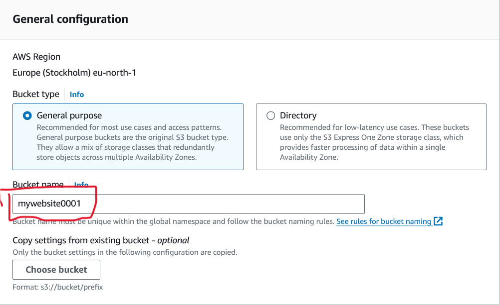
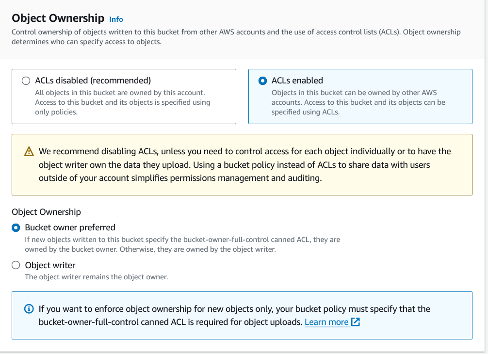

### Deploying-a-Static-Website-on-Amazon-S3
Deploying a static website on aws S3 using cloudFront

1. ## Create a bucket
   * Give a unique name for the bucket
   * AWS recommends > For Region, we recommend choosing an AWS Region that is geographically close to you. (This reduces latency and costs.)
   
   
2. ## Upload the your website files
   - Click on your bucket to open
   - Click on Upload to start the process of uploding 
   - below "Destination" tick Grand public-read-access: to allow access of our website
   - Finally click on upload to upload the files

   Go to your bucket properties; enable the "**Static website hosting**" and specify "index.html" like **index document**

Select the files and click on **Action**; click on **make public using ACL**

 **You can your website url in your bucket properties then scroll to the bottom**
 My Website is now available

 

